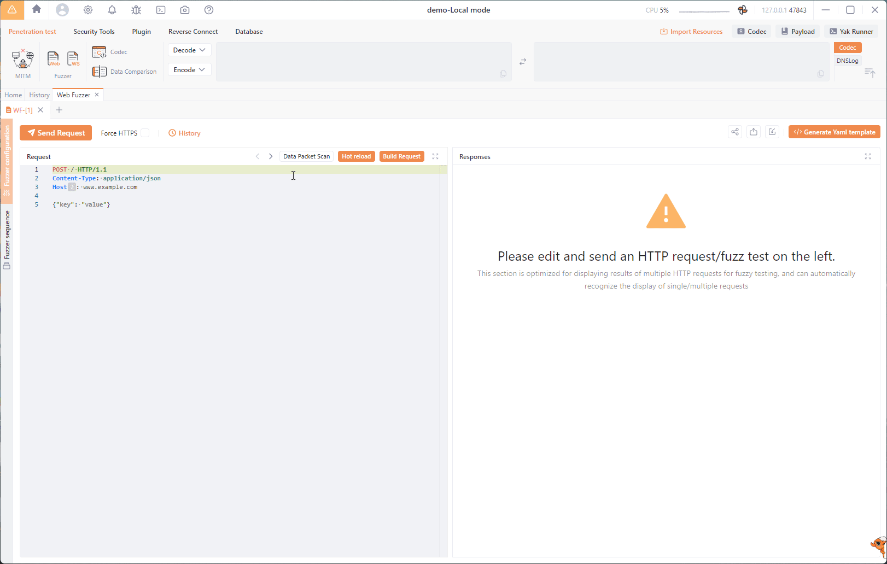

Please use: https://github.com/vigov5/yakit-tweaks

# English Translated versions of Yakit

My attempt at translating Yakit UI and some UI adjustments while waiting for official English version: https://github.com/yaklang/yakit/issues/1255#issuecomment-1849453926

## About Yakit
- https://github.com/yaklang/yakit
- https://www.yaklang.com/
- https://yaklang.io
- https://www.yaklang.com/

## Screenshot

## Download

https://github.com/vigov5/yakit/releases

## Notes
Some texts come from yak binary file or from plugins store, which are can't be translated. Google Translate is your friend.
